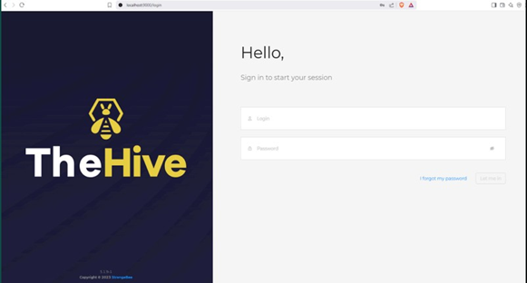
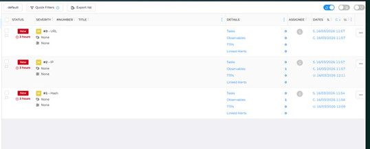
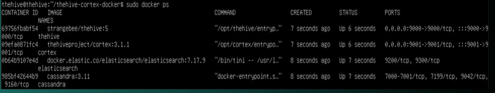

# 🛡️ Case Management & Analysis Tool

A comprehensive **SOC Case Management and Incident Response Platform** built using **TheHive, Cortex, Docker, Elasticsearch, and Ubuntu Server** to streamline security investigations, automate threat intelligence analysis, and improve incident response workflows.

---

# 📖 Project Overview

The **Case Management & Analysis Tool** is a centralized Security Operations Center (SOC) platform developed to manage, investigate, and analyze cybersecurity incidents efficiently.

The project demonstrates how modern incident response platforms such as **TheHive** and **Cortex** can be integrated with **Elasticsearch** and **Docker** to automate investigations, organize cases, enrich Indicators of Compromise (IOCs), and improve collaboration between security analysts.

The platform enables analysts to:

- Create and manage security incidents
- Assign investigation tasks
- Analyze Indicators of Compromise (IOCs)
- Automate threat intelligence lookups
- Track investigation progress
- Generate organized incident records
- Improve SOC operational efficiency

---

# 🎯 Objectives

- Build a centralized incident response platform
- Automate IOC enrichment using Cortex
- Integrate Docker-based security infrastructure
- Improve SOC case management workflow
- Reduce manual investigation effort
- Demonstrate practical incident response lifecycle
- Maintain organized case documentation
- Support analyst collaboration

---

# 🏗️ System Architecture

```
                    +----------------------+
                    |     Ubuntu Server    |
                    +----------+-----------+
                               |
                        Docker Containers
                               |
        +-----------+-----------+------------+
        |           |                        |
        |           |                        |
   TheHive      Cortex Engine        Elasticsearch
 Case Manager   IOC Analysis          Data Storage
        |           |                        |
        +-----------+------------+-----------+
                               |
                      Security Analyst
                               |
                      Incident Investigation
                               |
                        Case Resolution
```

---

# ⚙️ Incident Response Workflow

```
Alert Received
      │
      ▼
Create Case in TheHive
      │
      ▼
Assign Analyst
      │
      ▼
Add Observables
(IP / URL / Hash / Domain)
      │
      ▼
Run Cortex Analyzer
      │
      ▼
Threat Intelligence Enrichment
      │
      ▼
Investigation
      │
      ▼
Task Completion
      │
      ▼
Case Closure
```

---

# 🛠️ Technologies Used

| Technology | Purpose |
|------------|---------|
| TheHive v5 | Security Incident Response Platform |
| Cortex v3.1.1 | Threat Intelligence Analyzer |
| Elasticsearch 7.17 | Data Storage & Search Engine |
| Docker | Containerization |
| Docker Compose | Multi-container Deployment |
| Ubuntu Server 24.04 | Server Operating System |
| VirtualBox | Virtualization |
| VirusTotal | IOC Analysis |
| MalwareBazaar | Malware Intelligence |
| REST API | Platform Integration |

---

# 🐳 Docker Deployment

The complete SOC environment is deployed using Docker containers.

Services deployed include:

- TheHive
- Cortex
- Elasticsearch
- Cassandra

Key Benefits:

- Easy deployment
- Platform portability
- Service isolation
- Fast recovery
- Simplified maintenance
- Scalable architecture

---

# 🔍 TheHive Features

- Security Incident Management
- Case Creation
- Alert Management
- Task Assignment
- User Management
- Organization Management
- Timeline Tracking
- Case Collaboration
- Observable Management
- TLP / PAP Classification
- Incident Documentation

---

# ⚡ Cortex Analyzer Features

- IOC Enrichment
- VirusTotal Integration
- MalwareBazaar Integration
- IP Reputation Analysis
- Domain Analysis
- URL Analysis
- File Hash Analysis
- Automated Threat Intelligence
- Analyzer Execution from TheHive

---

# 📊 Elasticsearch Features

- Case Storage
- Alert Storage
- Fast Search
- Data Indexing
- Dashboard Support
- Historical Data Management
- Scalable Architecture


---

# 📸 Project Screenshots

## 🔐 TheHive Dashboard

> Centralized SOC dashboard for managing security incidents, alerts, and investigations.



---

## 📂 Case Management

> Create, assign, prioritize, and track security incidents throughout the investigation lifecycle.


---

## 📝 Task Management

> Assign investigation tasks to analysts and monitor task completion.


---

## 🔍 Observable Management

> Add Indicators of Compromise (IP, URL, Domain, Hash, Email) for investigation.



---

## ⚡ Cortex Analyzer

> Execute automated threat intelligence analyzers directly from TheHive.


---

## 🛡️ Threat Intelligence Results

> IOC enrichment using VirusTotal, MalwareBazaar and integrated analyzers.


---

## 🐳 Docker Environment

> Docker containers powering the complete SOC infrastructure.



---

## 📊 Elasticsearch Integration

> Elasticsearch backend used for indexing, searching, and storing investigation data.


---

## 📈 Case Timeline

> Complete investigation timeline showing analyst activities and case progression.


---

# 💡 Skills Demonstrated

### SOC Operations

- Security Incident Response
- Case Management
- Alert Investigation
- Threat Intelligence Analysis
- IOC Investigation
- Incident Documentation

### Threat Intelligence

- VirusTotal Integration
- MalwareBazaar Integration
- IOC Enrichment
- Hash Analysis
- URL Reputation Analysis
- Domain Intelligence
- IP Reputation Analysis

### Security Platforms

- TheHive
- Cortex
- Elasticsearch
- Docker
- Docker Compose

### Linux Administration

- Ubuntu Server
- Docker Installation
- Service Management
- Network Configuration
- User Management

### Incident Response

- Detection
- Analysis
- Containment
- Investigation
- Documentation
- Resolution

### Technical Skills

- Docker Deployment
- REST API Integration
- Virtualization
- Elasticsearch
- Security Automation
- Case Workflow Management

---

# 🚀 Future Scope

- Integration with Microsoft Sentinel
- Wazuh SIEM Integration
- Splunk Integration
- Automated Playbooks (SOAR)
- YARA Rule Support
- Sigma Rule Integration
- MITRE ATT&CK Mapping
- Email Security Integration
- Malware Sandbox Integration
- Automated Incident Response
- AI-assisted Threat Analysis
- Cloud Security Incident Management

  ---

# 📄 Project Documents

- 📘 **Project Documentation (PDF):** [Case_Management_Analysis_Tool.pdf](Case_Management_Analysis_Tool.pdf)

---

# ⚠️ Disclaimer

This project was developed **strictly for educational, academic, and cybersecurity learning purposes** within an authorized lab environment.

All demonstrations, configurations, and integrations were performed responsibly to understand **Security Operations Center (SOC)** workflows, incident response procedures, and threat intelligence analysis.

This repository **does not promote unauthorized access, malicious activities, or misuse of cybersecurity tools**. It is intended solely to demonstrate practical knowledge of modern SOC technologies including **TheHive, Cortex, Docker, and Elasticsearch**.

---

# 👨‍💻 Author

## Jay Soni

- 🎓 **M.Sc. Information Technology (Cyber Security)**
- 🎓 **B.Sc. Information Technology (Cyber Security)**
- 🌐 **Network Administrator**
- 🛡️ **Aspiring SOC Analyst**
- 🔍 **Cyber Security Enthusiast**
- ☁️ **Cloud Security Learner**

---

# 🎯 Key Learning Outcomes

Through this project I gained practical experience in:

- SOC Case Management
- Incident Response Lifecycle
- Threat Intelligence Integration
- IOC Investigation
- Docker Container Deployment
- Elasticsearch Administration
- Cortex Analyzer Integration
- Security Investigation Workflow
- Ubuntu Server Administration
- Security Documentation

---

# 📚 References

- TheHive Project Documentation
- Cortex Project Documentation
- Elasticsearch Documentation
- Docker Documentation
- VirusTotal
- MalwareBazaar
- MITRE ATT&CK Framework
- OWASP Security Resources

---

# 📜 License

This project is licensed under the **MIT License**.

See the [LICENSE](LICENSE) file for more information.

---

## ⭐ Support

If you found this project useful, please consider giving it a **⭐ Star** on GitHub.

It helps support the project and encourages future cybersecurity research and development.

---

## 🙏 Acknowledgements

Special thanks to the **TheHive Project**, **Cortex**, **Docker**, **Elasticsearch**, and the open-source cybersecurity community for providing powerful tools that enable practical SOC learning and security research.
